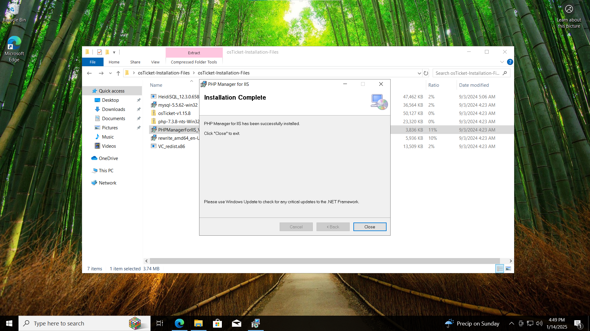

<h1>osTicket - Prerequisites and Installation</h1>
This tutorial outlines the prerequisites and installation of the open-source help desk ticketing system osTicket. 

<h2>Environments and Technologies Used</h2>

- Microsoft Azure (Virtual Machines/Compute)
- Remote Desktop
- Internet Information Services (IIS)

<h2>Operating Systems Used </h2>

- Windows 10</b> (21H2)

<h2>List of Prerequisites</h2>

- Enable IIS
- Install Web Platform Installer
- Install MySQL and set up Username and Password
- Install C++ Redistributable
- Configure Permissions and install Osticket

<h2>Installation Steps</h2>

You will enable IIS. You will go to control panel, programs, then program features, you will click turn windows features on or off. You will then click Internet Information Services and check that box and expand it, then expand World Wide Web Services, then expand Application Deployment Features and check CGI.

  

Open the Osticket folder and click PHPmanager and install and from the same folder you will install rewrite module

 

Install VCredist.x86

Install mysql and choose typical setup and then launch mysql wizard and choose standard configuration, and create username and password.

  

 
 
Configure IIS as admin (Register new PHP manager, enable extensions, Name helpdesk etc.)

